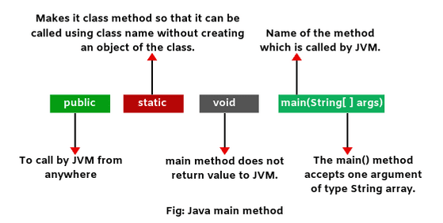
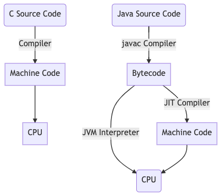
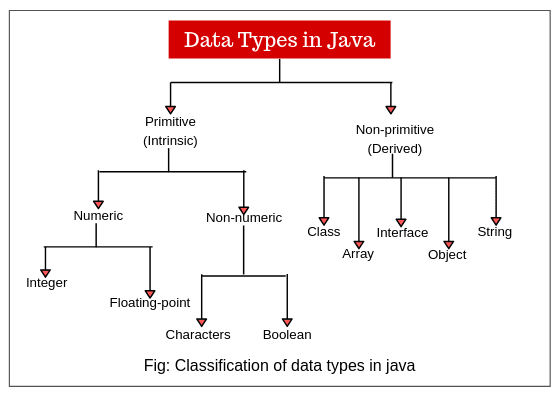
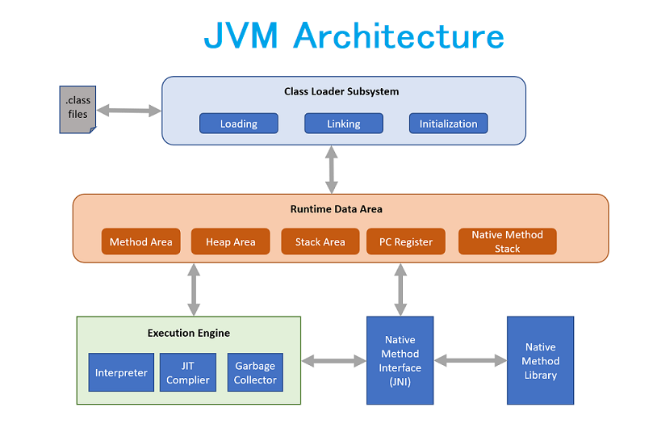
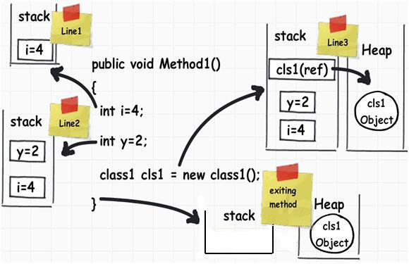
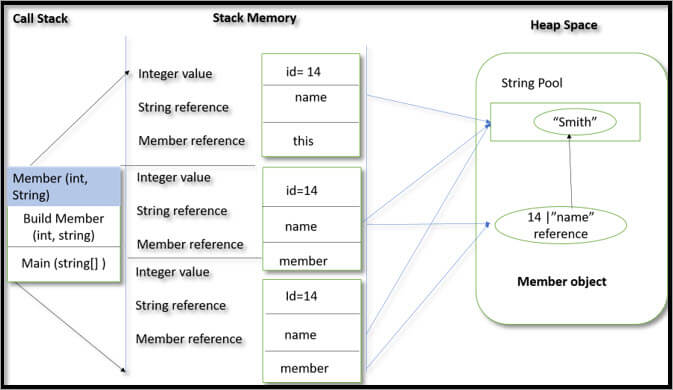

#Begin Java#
 
<h2>Introduction</h2>

<b>Why Use Java? 

</b>

- Java works on different platforms (Windows, Mac, Linux, Raspberry Pi, etc.) 
- It is one of the most popular programming language in the world 
- It has a large demand in the current job market 
- It is easy to learn and simple to use 
- It is open-source and free 
- It is secure, fast and powerful 
- It has a huge community support (tens of millions of developers) 
- Java is an object oriented language which gives a clear structure to programs and allows code to be reused, lowering  development costs 
- As Java is close to C++ and C#, it makes it easy for programmers to switch to Java or vice versa 

  

  
<h2>Data Structure</h2>

Java est un langage orienté objet, c'est-à-dire que les éléments manipulés sont des classes, ou plus exactement des objets, c'est-à-dire des instances de classes.
Toutefois ces objets contiennent des données possèdant un type (et une représentation). Ces données sont un ensemble d'éléments stockés en mémoire et baptisés pour l'occasion primitives. 
  Les données manipulées avec Java, sont typées, c'est-à-dire que pour chaque donnée que l'on utilise (dans les variables par exemple) il faut préciser le type de donnée, ce qui permet de connaître l'occupation mémoire (le nombre d'octets) de la donnée ainsi que sa représentation,
En réalité, toutes les valeurs différentes de True sont considérées comme fausses (donc considérées comme égales à False). Si la variable n'est pas initialisée, sa valeur par défaut est False.
 
 
Java est un langage qui supporte l’encapsulation de données. Cela signifie que lorsque nous créons une classe nous avons le choix de laisser accessible ou non les attributs et les méthodes au reste du programme. 

<b>La portée</b> 
Jusqu’à présent, nous avons vu qu’il existe deux portées différentes : <b>public et private</b>.  
 
<b>L’initialisation</b> 
En Java, on peut indiquer la valeur d’initialisation d’un attribut pour chaque nouvel objet 
 <b>Les attributs</b> 
Les attributs représentent l’état interne d’un objet. Nous avons vu précédemment qu’un attribut a une portée, un type et un identifiant. Il est déclaré de la façon suivante dans le corps de la classe
Jusqu’à présent, nous avons vu comment déclarer des attributs d’objet. C’est-à-dire que chaque instance d’une classe aura ses propres attributs avec ses propres valeurs représentant l’état interne de l’objet et qui peuvent évoluer au fur et à mesure de l’exécution de l’application.
  <b>Attributs de classe</b> 
La valeur de ces attributs est partagée par l’ensemble des instances de cette classe. Cela signifie que si on modifie la valeur d’un attribut de classe dans un objet, la modification sera visible dans les autres objets. Cela signifie également que cet attribut existe au niveau de la classe et est donc accessible même si on ne crée aucune instance de cette classe.
 
 <b>Attributs finaux</b> 
Un attribut peut être déclaré comme final. Cela signifie qu’il n’est plus possible d’affecter une valeur à cet attribut une fois qu’il a été initialisé. Dans cas, le compilateur exige que l’attribut soit initialisé explicitement.
  <b>Attributs de classe finaux</b> 
Il n’existe pas de mot-clé pour déclarer une constante en Java. Même si const est un mot-clé, il n’a aucune signification dans le langage. On utilise donc la combinaison des mots-clés static et final pour déclarer une constante. Par convention, pour les distinguer des autres attributs, on écrit leur nom en majuscules et les mots sont séparés par _
  public static final int NOMBRE_DE_ROUES = 4;  
  <b>  La valeur de retour</b> 
Une méthode peut avoir au plus un type de retour. Le compilateur signalera une erreur s’il existe un chemin d’exécution dans la méthode qui ne renvoie pas le bon type de valeur en retour. Pour retourner une valeur, on utilise le mot-clé return. Si le type de retour est un objet, la méthode peut toujours retourner la valeur spéciale null, c’est-à-dire l’absence d’objet. Une méthode qui ne retourne aucune valeur, le signale avec le mot-clé void

  <b>Les paramètres</b> 
Un méthode peut éventuellement avoir des paramètres (ou arguments). Chaque paramètre est défini par son type et par son nom.
  <b>Paramètre final</b> 
Un paramètre peut être déclaré final. Cela signifie qu’il n’est pas possible d’assigner une nouvelle valeur à ce paramètre.
  <b>Méthodes de classe</b> 
Les méthodes définissent un comportement d’un objet et peuvent accéder aux attributs de l’instance. À l’instar des attributs, il est également possible de déclarer des méthodes de classe. Une méthode de classe ne peut pas accéder aux attributs d’un objet mais elle peut toujours accéder aux éventuels attributs de classe.

Pour déclarer une méthode de classe, on utilise le mot clé static.
  <b>Les variables méthode </b> 
Il est possible de déclarer des variables où l’on souhaite dans une méthode. Par contre, contrairement aux attributs, les variables de méthode n’ont pas de valeur par défaut. Cela signifie qu’il est obligatoire d’initialiser les variables. Il n’est pas nécessaire de les initialiser dès la déclaration, par contre, elles doivent être initialisées avant d’être lues.

<b>Surcharge de méthode : overloading</b> 
Il est possible de déclarer dans une classe plusieurs méthodes ayant le même nom. Ces méthodes doivent obligatoirement avoir des paramètres différents (le type et/ou le nombre). Il est également possible de déclarer des types de retour différents pour ces méthodes. On parle de surcharge de méthode (method overloading). La surcharge de méthode n’a réellement de sens que si les méthodes portant le même nom ont un comportement que l’utilisateur de la classe jugera proche. Java permet également la surcharge de méthode de classe.
.  <b >Principe d’encapsulation</b> 
Un objet est constitué d’un état interne (l’ensemble de ses attributs) et d’une liste d’opérations disponibles pour ses clients (l’ensemble de ses méthodes publiques). 
En programmation objet, il est important que les clients d’un objet en connaissent le moins possible sur son état interne.
 En programmation objet, le principe d’encapsulation nous incite à contrôler et limiter l’accès au contenu de nos classes au strict nécessaire afin de permettre le couplage le plus faible possible. L’encapsulation en Java est permise grâce à la portée private.
On considère que tous les attributs d’une classe doivent être déclarés private afin de satisfaire le principe d’encapsulation.

Cependant, il est parfois utile pour le client d’une classe d’avoir accès à une information qui correspond à un attribut de l’état interne de l’objet. Plutôt que de déclarer cet attribut public, il existe en Java des méthodes dont la signature est facilement identifiable et que l’on nomme getters et setters (les accesseurs). Ces méthodes permettent d’accéder aux propriétés d’un objet ou d’une classe.
  <b>Cycle de vie d’un objet</b> 
Ce chapitre détaille la création d’un objet et son cycle de vie. Nous aborderons notamment les constructeurs et les mécanismes de gestion de la mémoire de la JVM.

<b>Le constructeur</b> 
Il est possible de déclarer des méthodes particulières dans une classe que l’on nomme constructeurs. Un constructeur a pour objectif d’initialiser un objet nouvellement créé afin de garantir qu’il est dans un état cohérent avant d’être utilisé.
 <b>Les énumérations X</b> 
Dans une application, il est très utile de pouvoir représenter des listes finies d’éléments. Par exemple, si une application a besoin d’une liste de niveaux de criticité, elle peut créer des constantes dans une classe utilitaire quelconque.
  
 

  
>

     

 
   